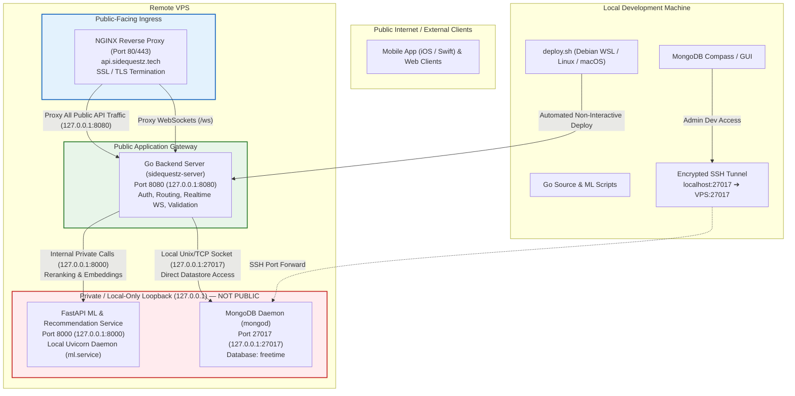

# SideQuestz — Backend Infrastructure & Deployment Architecture

This document outlines the hosting environment, server architecture, network security boundaries, local development workflow, and deployment pipeline for the SideQuestz platform.

---

## 1. High-Level Architecture & Network Topology

All public internet traffic is strictly mediated by the **Go Backend Gateway**. Internal microservices—specifically the **Python FastAPI ML Service** and the **MongoDB Database**—are private, bound to localhost loopback (`127.0.0.1`), and have **zero direct public exposure**.



---

## 2. Network Security & Public vs. Private Boundaries

> [!IMPORTANT]
> **The ML service is NOT open to the public.** 
> All external client requests (mobile app, web, third-party webhooks) must pass through the **Go Backend**. The Go backend authenticates the client, enforces access controls, enriches the request with database context, invokes the ML service over local loopback (`http://127.0.0.1:8000`), and formats the final response.

### Component Isolation Summary

| Component | Bound Address | Publicly Accessible? | Routing & Access Policy |
| :--- | :--- | :---: | :--- |
| **NGINX Reverse Proxy** | `0.0.0.0:80`<br/>`0.0.0.0:443` | **YES** | Terminates SSL/TLS. Proxies `/` and `/ws` exclusively to the Go backend (`http://127.0.0.1:8080`). **No routes exist to port 8000 or port 27017.** |
| **Go Backend Server** | `127.0.0.1:8080` | **YES** *(via NGINX)* | Sole entry point for all application APIs, JWT auth, WebSocket connections, split billing, and catalog endpoints. |
| **Python FastAPI ML Service** | `127.0.0.1:8000` | **NO (Private / Local Only)** | Bound strictly to loopback (`127.0.0.1`). Blocked from external internet by VPS firewall and NGINX configuration. Only reachable internally by the Go backend. |
| **MongoDB Database** | `127.0.0.1:27017` | **NO (Private / Local Only)** | Bound strictly to loopback (`127.0.0.1`). External access is strictly prohibited except via authorized SSH port forwarding (`ssh -L`). |

### Why Everything Public Goes Through the Go Backend

1. **Authentication & Authorization**: The ML engine is a pure computation microservice with no user credential state. The Go backend validates JWT bearer tokens, checks account status, and verifies session validity before any ML inference occurs.
2. **Data Hydration & Security**: External clients never construct raw vector payloads or pass unrestricted embedding updates. The Go backend pulls validated user preference vectors and activity candidates directly from MongoDB, sanitizes them, and passes structured schemas to FastAPI.
3. **Resilience & Fallback Handling**: If the Python ML worker restarts, reloads model weights, or experiences high memory pressure, Go's [`pkg/ml`](file:///c:/Users/Max/Documents/HackGT-13-Proj/Backend/pkg/ml) client intercepts connection drops or timeouts and gracefully falls back to deterministic database ranking (by distance, popularity, or category) so end-users never experience an outage.
4. **Denial-of-Service & Compute Protection**: Heavy ML matrix operations and neural rerankers are protected behind Go's rate-limiting, CORS policies, and request-size safeguards.

---

## 3. Server Components on the VPS

### A. NGINX Reverse Proxy
- **Role**: Ingress proxy for all incoming HTTPS traffic for `api.sidequestz.tech` and `sidequestz.tech`.
- **Ports**: Listens on port 80 (HTTP redirect) and port 443 (HTTPS with Let's Encrypt certificates).
- **Configuration Highlights**:
  - `client_max_body_size 20M` allows multipart avatar/photo uploads to Go.
  - Proxies standard REST endpoints to `http://127.0.0.1:8080`.
  - Supports HTTP/1.1 protocol upgrades for persistent WebSockets on `/ws`.
  - **Zero proxy routes to port 8000**: External requests to `/v1/events/rank` or `/v1/compatibility/*` from the internet receive `404 Not Found`.
- **Config file**: [`sidequestz.tech`](file:///c:/Users/Max/Documents/HackGT-13-Proj/Backend/sidequestz.tech) (deployed to `/etc/nginx/sites-available/`).

### B. Go Backend Binary & Systemd Service
- **Role**: Primary API gateway, WebSocket hub, and business logic coordinator.
- **Binary Path**: `/opt/backend/sidequestz-server`
- **Systemd Unit**: `/etc/systemd/system/backend.service` (aliased to `sidequestz.service`)
- **Port**: Binds internally to `127.0.0.1:8080`.
- **Environment Variables**:
  - `PORT=8080`: HTTP listen port.
  - `MONGO_URI=mongodb://127.0.0.1:27017`: Local MongoDB connection string.
  - `MONGO_DB=freetime`: Target database name.
  - `ML_SERVICE_URL=http://127.0.0.1:8000`: Internal local address of the FastAPI ML engine.
  - `JWT_SECRET`: Secret key for signing session tokens.
- **Helpful Commands on the VPS**:
  ```bash
  # Check service status
  systemctl status backend

  # Restart service
  systemctl restart backend

  # View live trailing logs
  journalctl -u backend -f -n 50
  ```
- **Config file**: [`backend.service`](file:///c:/Users/Max/Documents/HackGT-13-Proj/Backend/backend.service).

### C. Python FastAPI ML Service (Local Microservice)
- **Role**: Internal vector compatibility scoring, candidate activity reranking, and moving-average preference updates.
- **Location**: `/opt/ml`
- **Systemd Unit**: `/etc/systemd/system/ml.service`
- **Binding**: Strictly `127.0.0.1:8000` (`--host 127.0.0.1 --port 8000`).
- **Access Control**: **Private only**. Consumed solely by Go via [`Backend/pkg/ml/client.go`](file:///c:/Users/Max/Documents/HackGT-13-Proj/Backend/pkg/ml/client.go).
- **Core Internal Endpoints**:
  - `POST /v1/events/rank`: Ranks activity/event candidates against a user's taste embedding and search context.
  - `POST /v1/compatibility/user-embedding/update`: Performs moving-average updates on user preference embeddings when events receive user feedback.
- **Helpful Commands on the VPS**:
  ```bash
  # Check service status
  systemctl status ml

  # Restart ML service
  systemctl restart ml

  # View live ML logs
  journalctl -u ml -f -n 50
  ```
- **Config file**: [`ml.service`](file:///c:/Users/Max/Documents/HackGT-13-Proj/Backend/ml.service).

### D. MongoDB Database
- **Role**: Primary datastore for activities, OSM locations, users, trips, itineraries, and forum chats.
- **Binding**: Strictly `127.0.0.1:27017` (loopback only).
- **Primary Database**: `freetime`
- **Key Collections**:
  - `activities`: OSM trails, venues, parks, and Atlanta events.
  - `users`: User accounts, profiles, taste tags, and 1024-d preference embeddings.
  - `itineraries`: Generated and saved trip itineraries.
  - `forum_posts`: Live hangout and sidequest forum posts.

---

## 4. Local Development & MongoDB SSH Tunnel

Because MongoDB and ML services are bound strictly to `127.0.0.1` on the VPS, direct public connections are refused. To inspect or manage data with GUI tools on your local development machine:

### Starting the SSH Tunnel
Run the following command in a local terminal (using the host and user credentials defined in your local `.env`):
```bash
ssh -N -L 27017:127.0.0.1:27017 <user>@<vps-ip>
```

- `-N`: Forwards ports without spawning an interactive shell.
- `-L 27017:127.0.0.1:27017`: Forwards local port `27017` across the encrypted SSH pipe to `127.0.0.1:27017` on the VPS.

### Connecting Local Tools
While the tunnel is active, connect tools like **MongoDB Compass**, **Studio 3T**, or your local Go development server directly to:
```
mongodb://127.0.0.1:27017
Database: freetime
```

---

## 5. Deployment Pipeline

Automated deployment scripts handle compiling, syncing, and restarting services without manual SSH steps or password prompts.

### A. Deploying the Go Backend
Run from the `Backend` directory:
```bash
./deploy.sh
```
- **Builds**: Compiles a static Linux `x86_64` binary via [`build.sh`](file:///c:/Users/Max/Documents/HackGT-13-Proj/Backend/build.sh) inside `bin/sidequestz-server`.
- **Uploads**: Securely copies binary to `/opt/backend/sidequestz-server.new` and atomically renames it to avoid `ETXTBSY` ("Text file busy").
- **Syncs**: Updates `/etc/systemd/system/backend.service` and aliases `sidequestz.service`.
- **Restarts**: Triggers `systemctl restart backend` and validates that the service is `active (running)`.

### B. Deploying the ML Service
Run from the `ml` directory:
```bash
./deploy.sh
```
- **Syncs Files**: Synchronizes Python models and FastAPI code to `/opt/ml` (excluding caches and local `.venv`).
- **Sets Permissions**: Sets `chmod -R 755 /opt/ml`.
- **Prepares Environment**: Automatically sets up or updates `/opt/ml/.venv` with `requirements.txt`.
- **Syncs & Restarts**: Updates `/etc/systemd/system/ml.service`, reloads systemd, restarts `ml.service`, and checks status.

Both scripts are fully compatible with **Debian WSL**, **native Linux**, and **macOS**, featuring automatic non-interactive authentication via `sshpass` or OpenSSH `SSH_ASKPASS`.
