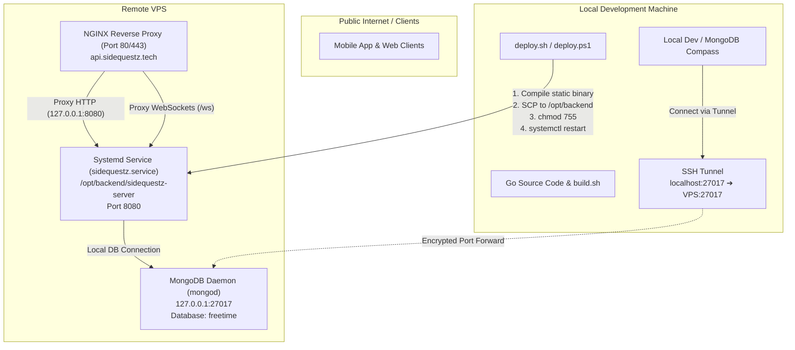

# SideQuestz — Backend Infrastructure & Deployment Architecture

This document outlines the hosting environment, server architecture, local development workflow, and deployment pipeline for the SideQuestz backend.

---

## 1. High-Level Architecture



---

## 2. Server Components on the VPS

### A. NGINX Reverse Proxy
- **Role**: Entry point for all external web traffic and API requests targeting `sidequestz.tech`.
- **Ports**: Listens on port 80 (HTTP) and port 443 (HTTPS with TLS certificates).
- **Features**:
  - Handles client request buffering and max body size (`client_max_body_size 20M` for image uploads).
  - Reverse proxies all standard REST API requests directly to `http://127.0.0.1:8080`.
  - Upgrades and handles persistent WebSocket connections at `/ws`.
- **Config file**: [`sidequestz.tech`](file:///c:/Users/Max/Documents/HackGT-13-Proj/Backend/sidequestz.nginx.conf) (deployed to `/etc/nginx/sites-available/`).

### B. Backend Binary & Systemd Service
- **Role**: The core Go REST API server and real-time WebSocket hub.
- **Binary Path**: `/opt/backend/sidequestz-server`
- **Systemd Unit**: `/etc/systemd/system/sidequestz.service`
- **Port**: Binds to internal port `:8080` (`http://127.0.0.1:8080`).
- **Process Management**:
  - Managed by systemd with auto-restart on crashes (`Restart=always`, `RestartSec=5s`).
  - Hardened with systemd security isolation (`NoNewPrivileges=true`, `ProtectSystem=full`).
- **Helpful Commands on the VPS**:
  ```bash
  # Check service status
  systemctl status sidequestz

  # Restart service
  systemctl restart sidequestz

  # View live trailing logs
  journalctl -u sidequestz -f

  # View recent logs
  journalctl -u sidequestz -n 50 --no-pager
  ```
- **Config file**: [`sidequestz.service`](file:///c:/Users/Max/Documents/HackGT-13-Proj/Backend/sidequestz.service).

### C. MongoDB Database
- **Role**: Primary datastore for activities, places, itineraries, users, and forum posts.
- **Binding**: Runs locally on the VPS bound to `127.0.0.1:27017` (not exposed to the public internet for security).
- **Primary Database**: `freetime`
- **Key Collections**:
  - `activities`: OSM trails, parks, venues, and curated Atlanta events.
  - `users`: User profiles, credentials, preferences, and taste profiles.
  - `itineraries`: Saved and active trip plans.
  - `forum_posts`: Live sidequests and "I'm free" hangout posts.

---

## 3. Local Development & MongoDB SSH Tunnel

Because MongoDB is bound to `127.0.0.1:27017` on the remote VPS, direct public connections are blocked by the firewall. To access the live database from your local machine, an SSH tunnel forwards local port `27017` to the remote server.

### Starting the SSH Tunnel
Run the following command on your local machine (keep this terminal open while developing):
```bash
ssh -N -L 27017:127.0.0.1:27017 root@45.32.223.40
```

- `-N`: Do not execute a remote command (only forward ports).
- `-L 27017:127.0.0.1:27017`: Forwards local port `27017` to `127.0.0.1:27017` on the VPS.

### Connecting Locally
While the tunnel is active, you can connect tools like **MongoDB Compass**, **Studio 3T**, or your local Go backend directly to:
```
mongodb://127.0.0.1:27017
Database: freetime
```

---

## 4. Deployment Pipeline

The deployment scripts automate compiling, uploading, and restarting the backend binary on the VPS in one step.

### What the Deploy Scripts Do:
1. **Build**: Calls [`build.sh`](file:///c:/Users/Max/Documents/HackGT-13-Proj/Backend/build.sh) (`--amd64`) to compile a stripped, static Linux x86_64 binary into `bin/sidequestz-server`.
2. **Transfer**: Securely copies `bin/sidequestz-server` over SSH/SCP into `/opt/backend/sidequestz-server` on the VPS.
3. **Permissions**: Sets execution permissions with `chmod 755 /opt/backend/sidequestz-server`.
4. **Restart**: Issues `systemctl restart sidequestz` on the VPS and checks `systemctl status` to confirm it is active and running.

### Configuration (`.env`)
Credentials and target hosts are managed through [`.env`](file:///c:/Users/Max/Documents/HackGT-13-Proj/Backend/.env):

### Running Deployment:

- **From Linux / macOS / Git Bash**:
  ```bash
  ./deploy.sh
  ```

- **From Windows PowerShell**:
  ```powershell
  .\deploy.ps1
  ```

- **From Windows Command Prompt**:
  ```bat
  deploy.bat
  ```
