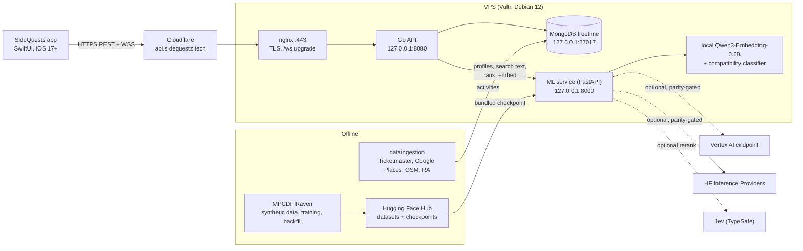

# SideQuests

**Turn waiting into wandering.** A HackGT 13 project.

SideQuests is an iPhone app for the hours you didn't plan. Say where you are, when you need to be back
and what you're in the mood for, and it builds a timed plan of nearby events and places (a "sidequest")
with the transit legs in between. A plan can stay private, go to your friends, or be posted to the Forum
for people nearby to join. Every plan that becomes a group gets a chat, a shared album and an equal-split
tab. Ratings after the outing tune a taste profile that the next plan starts from.

Under the hood a SwiftUI app talks to a Go API. The API retrieves candidate activities from a MongoDB
catalog that a data-ingestion pipeline fills, scores them with a trained compatibility model over Qwen3
text embeddings (served by a small FastAPI service), and solves a time-feasible itinerary with an
iterative DAG planner. The product is called SideQuests; the code, bundle id and service names say
**SideQuestz**.

## Architecture



Everything public goes through the Go API; the ML service and MongoDB listen on loopback only. The
data pipeline and the training jobs run offline and are not deployed.

## Repository layout

| Path | What it is | Start with |
|---|---|---|
| `frontend/` | The SwiftUI app (`SideQuestz.xcodeproj`), unit and UI tests, the API contract | [frontend/README.md](frontend/README.md), [frontend/API_CONTRACT.md](frontend/API_CONTRACT.md) |
| `Backend/` | The Go API: auth, planner, itineraries, forum, threads, splits, checkout agent, Facebook, realtime hub; deploy scripts | [docs/ARCHITECTURE.md](docs/ARCHITECTURE.md), [docs/PLANNER.md](docs/PLANNER.md) |
| `ml/` | The FastAPI ML service (embeddings, profile texts, ranking, Jev rerank), the compatibility classifier, data generation and training on MPCDF Raven | [ml/README.md](ml/README.md), [ml/models.md](ml/models.md) |
| `dataingestion/` | The Python pipeline that fills MongoDB with events, places and trails, and the Saltlight Harbor demo snapshot | [dataingestion/README.md](dataingestion/README.md), [docs/DATA.md](docs/DATA.md) |
| `docs/` | This documentation set, the generated API examples (`docs/api/examples/`) and the design notes behind the integration (`docs/design/`) | [docs/ARCHITECTURE.md](docs/ARCHITECTURE.md) |

## Quick start

Each part runs on its own. The app defaults to the live server, so the shortest path is the app alone.

**App** (macOS with Xcode 26.6 or newer; see [frontend/README.md](frontend/README.md) for signing and
running on a phone):

```sh
open frontend/SideQuestz.xcodeproj      # scheme SideQuestz, pick a simulator, ⌘R
```

`Info.plist` points at `https://api.sidequestz.tech`. Launch arguments switch that: `-SQAPIMode mock`
runs fully offline on demo data, `-SQAPIBaseURL http://127.0.0.1:8080 -SQWebSocketURL
ws://127.0.0.1:8080/ws` targets a local server, `-SQDemoPassword …` enables the demo sign-in link.

**MongoDB** (the backend, the ML tools and the ingestion pipeline all use `mongodb://127.0.0.1:27017`,
database `freetime`):

```sh
docker run -d --name sq-mongo -p 27017:27017 mongo:7
# the demo city: copy the embedded Saltlight catalog (100 activities with embedding texts and vectors)
# from production's demo_activities into the local Mongo (seed-demo and the planner need it)
Backend/scripts/pull-demo-catalog.sh
```

**ML service** (Python 3.11+; the bundled classifier loads without any token; the embedding provider
falls back to the local Qwen model, which downloads ~1.2 GB on first use):

```sh
cd ml
python3 -m venv .venv && .venv/bin/pip install -r requirements.txt
.venv/bin/uvicorn api.main:app --port 8000        # http://127.0.0.1:8000/docs, GET /healthz
```

**Backend** (Go; version in `Backend/go.mod`):

```sh
cd Backend
APP_ENV=dev HTTP_ADDR=127.0.0.1:8080 MONGO_URI=mongodb://127.0.0.1:27017 MONGO_DB=freetime \
ML_SERVICE_URL=http://127.0.0.1:8000 JWT_SECRET=dev-secret-dev-secret-dev-secret-dev PLANNER=dag \
PUBLIC_BASE_URL=http://127.0.0.1:8080 DEMO_PASSWORD=demo \
  sh -c 'go run ./cmd/sidequestz-admin seed-demo && go run .'
```

`seed-demo` creates the demo account and its friends, plans and chats (idempotent; it refuses to run
before the demo catalog is imported). Then run the app with `-SQAPIBaseURL http://127.0.0.1:8080
-SQWebSocketURL ws://127.0.0.1:8080/ws -SQDemoPassword demo`. `make build-native` in `Backend/` builds
both binaries (`bin/sidequestz-server`, `bin/sidequestz-admin`) for the Mac.

**Data ingestion** (Python 3.12; only needed to refresh the real catalog, keys in the root `.env`):

```sh
cd dataingestion
python3.12 -m venv .venv && .venv/bin/pip install -r requirements.txt
.venv/bin/python -m ingest init-db && .venv/bin/python -m ingest run ticketmaster --dry-run
```

## Tests

```sh
# iOS unit tests (seconds) and UI tests (minutes), on the mock backend
xcodebuild test -project frontend/SideQuestz.xcodeproj -scheme SideQuestz \
  -destination 'platform=iOS Simulator,name=iPhone 17e' -only-testing:SideQuestzTests
xcodebuild test -project frontend/SideQuestz.xcodeproj -scheme SideQuestz \
  -destination 'platform=iOS Simulator,name=iPhone 17e' -only-testing:SideQuestzUITests
# opt-in: the demo account against a real server, screenshots attached to the result (it never starts a sidequest)
TEST_RUNNER_SQ_LIVE_DEMO_PASSWORD='…' xcodebuild test -project frontend/SideQuestz.xcodeproj -scheme SideQuestz \
  -destination 'platform=iOS Simulator,name=iPhone 17e' -only-testing:SideQuestzUITests/LiveSmokeUITests
# regenerate docs/api/examples from the app's ContractTests (run from frontend/; see docs/api/README.md)
cd frontend && TEST_RUNNER_SQ_DUMP_CONTRACT=/tmp/sq-contract xcodebuild test -project SideQuestz.xcodeproj \
  -scheme SideQuestz -destination 'platform=iOS Simulator,name=iPhone 17e' \
  -only-testing:SideQuestzTests/ContractTests && python3 scripts/gen_contract_examples.py /tmp/sq-contract API_CONTRACT.md

# Go: unit tests plus Mongo-backed tests (throwaway sq_test_* databases; skipped without a server)
cd Backend && go test ./...
cd Backend && make test-db       # the whole suite against sq-mongo with -race; a missing server fails instead of skipping
cd Backend && go test -tags integration ./pkg/planner/mongosource/   # the planner against copies of the real catalogs
cd Backend && BASE_URL=https://api.sidequestz.tech scripts/smoke.sh   # healthz, sign-up, me, refresh rotation, logout

# ML service (ML_TEST_LOCAL_EMBEDDER=1 and ML_TEST_HF=1 add the slow local-model and HF parity tests)
cd ml && .venv/bin/python -m unittest discover

# data ingestion (fixture tests; Mongo tests skip when Mongo is down)
cd dataingestion && .venv/bin/python -m pytest

# documentation links
python3 docs/scripts/check_links.py
```

## Deploy

The API (`sidequestz.service`) and the ML service (`ml.service`) run on one VPS behind Cloudflare.
`cd ml && ./deploy.sh`, then `cd Backend && ./deploy.sh`; the ordered runbook, rollback, logs and health
checks are in [docs/DEPLOY.md](docs/DEPLOY.md). Credentials come from the root `.env` and are never
printed or uploaded. There is no website: `sidequestz.tech` has no DNS record, and the API's root
answers a JSON 404 by design.

## The demo account

The judges' account is **Sandy Byte** (`@sandybyte`, `demo@sidequestz.tech`), a student in Saltlight
Harbor, a fictional seaside city whose 100 activities are the `demo_activities` catalog. Her password is
not in the repository: the server's seed reads it from `DEMO_PASSWORD`, and the app receives it through
the `SQ_DEMO_PASSWORD` build setting (`xcodebuild … SQ_DEMO_PASSWORD='…'`) or the `-SQDemoPassword`
launch argument. When the app has it, the sign-in screen shows **Use the demo account**, which fills in
her email and password and signs in. Without it, sign in by typing them, or create your own account (new
accounts get the real Atlanta catalog). The walkthrough is in [docs/DEMO.md](docs/DEMO.md), and a one-page
brief for the account in [docs/DEMO_ACCOUNT.md](docs/DEMO_ACCOUNT.md).

## Configuration and secrets

Names only; values live in gitignored files with mode 0600 and are never committed, logged or echoed.

| Where | Names | Read by |
|---|---|---|
| Root `.env` (a developer's Mac, gitignored) | `DEPLOY_HOST`, `DEPLOY_USER`, `DEPLOY_PASSWORD`, `DEPLOY_REMOTE_DIR`, `DEPLOY_SERVICE` (the API's systemd unit, `sidequestz`), `HF_TOKEN`, `TYPESAFE_API_KEY`, `GOOGLE_APPLICATION_CREDENTIALS` (path to the gitignored `gcp-sa.json`), `DEMO_PASSWORD` | the deploy scripts (they read only `DEPLOY_*`), local ML tools, the seed |
| `/opt/backend/.env` (VPS; template `Backend/.env.example`) | `APP_ENV`, `HTTP_ADDR`, `PUBLIC_BASE_URL`, `MONGO_URI`, `MONGO_DB`, `JWT_SECRET`, `ML_SERVICE_URL`, `PLANNER`, `TRUST_PROXY`, `FB_APP_ID`, `FB_APP_SECRET`, `FB_TOKEN_KEY` (set it in production), `DEMO_PASSWORD`; optional `ML_*`, `PLANNER_*`, `FB_GRAPH_VERSION`, `DEMO_TZ`, `DEV_RESET_CODES`, `CHECKOUT_STEP_DELAY`, `ACCESS_TOKEN_TTL`, `REFRESH_TOKEN_TTL`, `MAX_PHOTO_BYTES`, `MAX_JSON_BYTES` | the Go API and `sidequestz-admin` |
| `/opt/ml/.env` (VPS) | `HF_TOKEN`, `TYPESAFE_API_KEY`, `GOOGLE_APPLICATION_CREDENTIALS`; optional `EMBED_*`, `HF_EMBED_*`, `HF_ROUTER_BASE`, `HF_AUTH_BACKOFF`, `VERTEX_*`, `RANKING_*`, `SEARCH_WEIGHT`, `USER_EMBEDDING_ALPHA`, `RERANK_TOP_K`, `RERANK_TIMEOUT_SECONDS`, `LOG_LEVEL` (`ml.service` sets several of these itself) | the ML service and its timer job |
| Root `.env`, ingestion keys (see `dataingestion/.env.example`) | `MONGODB_URI`, `MONGODB_DB`, `TICKETMASTER_API_KEY`, `GOOGLE_MAPS_API_KEY`, `GEMINI_API_KEY`, `GEMINI_MODEL`, `MUSE_API_KEY`, `SERPAPI_API_KEY`, `PREDICTHQ_TOKEN`, `NPS_API_KEY`, `HF_TOKEN`, `CONTACT_EMAIL` | `python -m ingest …` (offline) |
| Xcode | build setting `SQ_DEMO_PASSWORD` → `Info.plist` `SQDemoPassword`; `Info.plist` `SQAPIMode`, `SQAPIBaseURL`, `SQWebSocketURL`; launch arguments `-SQAPIMode`, `-SQAPIBaseURL`, `-SQWebSocketURL`, `-SQDemoPassword`, `-SQSlowLoadingAfter`, `-SQSkipIntro`, `-SQResetSession`, `-SQMockLatency`, `-SQMockFail`, `-SQVoiceDemo`, `-SQRoute` (mock mode only); test-runner variables `TEST_RUNNER_SQ_DUMP_CONTRACT`, `TEST_RUNNER_SQ_LIVE_DEMO_PASSWORD`, `TEST_RUNNER_SQ_LIVE_API_URL` | the app and its tests |
| Test runs only | `MONGO_TEST_URI`, `CI=1` (no Mongo = failure), `ML_LIVE_URL` (Go tests against a running ML service), `DISABLE_RATE_LIMITS`, `ML_TEST_LOCAL_EMBEDDER`, `ML_TEST_HF`, `ML_TEST_MONGO_URI` | `go test`, `python -m unittest` |

Embedding-provider settings exist only on the ML service; the Go API never holds a provider token.

## Documentation

| Page | What it covers |
|---|---|
| [docs/ARCHITECTURE.md](docs/ARCHITECTURE.md) | Components and interfaces, the token lifecycle, per-user catalogs and home base, sequence diagrams, how the API contract is governed |
| [docs/PLANNER.md](docs/PLANNER.md) | What a plan guarantees, retrieval, the iterative DAG loop, outputs, follow-up calls, knobs, how to inspect a run |
| [docs/EMBEDDINGS.md](docs/EMBEDDINGS.md) | The one embedding model and text format, providers and the parity gate, when vectors are computed, where they are stored |
| [docs/DEPLOY.md](docs/DEPLOY.md) | The VPS, services, deploy scripts, runbook, rollback, logs, health checks, Cloudflare notes, local dev loop |
| [docs/DEMO.md](docs/DEMO.md) | Sandy Byte, what is seeded, the three-minute walkthrough, known limits, how to reset |
| [docs/DATA.md](docs/DATA.md) | The `activities` schema, categories, indexes, sources, commands, the demo snapshot, quotas, attribution |
| [docs/ROADMAP.md](docs/ROADMAP.md) | What is simulated and what a real integration needs |
| [docs/design/README.md](docs/design/README.md) | The detailed design notes the integration was built from |
| [frontend/API_CONTRACT.md](frontend/API_CONTRACT.md), [docs/api/README.md](docs/api/README.md), [docs/api/examples/](docs/api/examples/) | Every endpoint, the JSON examples generated from the app's tests, and how to change the contract |
| [Backend/pkg/api/README.md](Backend/pkg/api/README.md) | The Go API's package layout and the seams a handler uses (store, realtime, planner, profiles) |
| [ml/README.md](ml/README.md), [ml/models.md](ml/models.md), [ml/training.md](ml/training.md), [ml/dataset.md](ml/dataset.md) | The ML service API, the compatibility model card, the training recipe, the synthetic datasets |
| [dataingestion/README.md](dataingestion/README.md), [dataingestion/DATA_COLLECTION_SPEC.md](dataingestion/DATA_COLLECTION_SPEC.md) | Running the pipeline, and the full data-collection design |

## Credits

- The app's type is [JetBrains Mono](https://www.jetbrains.com/lp/mono/), used under the SIL Open Font
  License 1.1 (`frontend/SideQuestz/Resources/Fonts/JetBrainsMono-OFL.txt`).
- Trails and place data include OpenStreetMap data, © OpenStreetMap contributors (ODbL). Elevation
  profiles come from OpenTopoData.
- Event and place listings come from the Ticketmaster Discovery API, Google Places and Resident Advisor
  under their respective terms; the catalog is not redistributed.
- Embeddings use `Qwen/Qwen3-Embedding-0.6B`; the synthetic training data was written and judged by
  `Qwen/Qwen3.5-9B` (both Apache-2.0) on the MPCDF Raven cluster.
- Saltlight Harbor, Sandy Byte and every demo venue are fictional.
