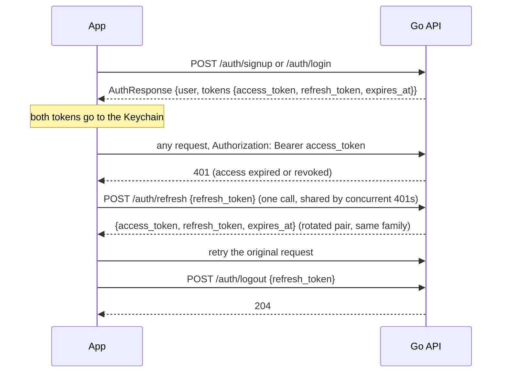

# Architecture

How the four parts of SideQuests fit together, and where each interface is defined. The detailed
designs are in [design/](design/README.md); this page is the map.

## Components and interfaces

| Caller → callee | Protocol | Auth | Defined where |
|---|---|---|---|
| iOS app → Go API | HTTPS, JSON with `snake_case` keys, RFC 3339 UTC times, integer cents, `X-Time-Zone: <IANA id>` on every request; lists are bare arrays except `GET /forum/posts` and `GET /me/past-events` (`{items, next_cursor}`) | `Authorization: Bearer <access JWT>` on everything except `/auth/*`, `GET /photos/{id}`, `GET /tickets/{id}`, the hosted pages and `GET /healthz` | [frontend/API_CONTRACT.md](../frontend/API_CONTRACT.md), the Swift models in `frontend/SideQuestz/Models/`, `Backend/pkg/contract`, examples in [api/examples/](api/examples/) |
| iOS app → Go API realtime | `WSS /ws`, envelope `{"type": "<event>", "data": {…}}`, `{"type":"connected"}` on open, ping every 25 s | bearer header, `?token=` fallback; invalid → 401 before the upgrade; ≤ 5 sockets per user | `Backend/pkg/realtime`, `frontend/SideQuestz/Services/WebSocketService.swift` |
| Cloudflare → nginx → Go | 443 with TLS, proxied to `127.0.0.1:8080`; `/ws` upgraded | TLS at nginx (Let's Encrypt); `TRUST_PROXY=1` makes the API read the forwarded client IP for rate limits | `Backend/sidequestz.tech`, [DEPLOY.md](DEPLOY.md) |
| Go API → MongoDB | official driver, `127.0.0.1:27017`, database `freetime` | loopback only | `Backend/pkg/store` (one file per collection), `Backend/pkg/datastore` |
| Go API → ML service | HTTP JSON on `127.0.0.1:8000`: `POST /v1/user-profile`, `POST /v1/search-profile`, `POST /v1/embed`, `POST /v1/events/rank`, `POST /v1/compatibility/user-embedding/update`, `GET /healthz` | none (loopback) | `Backend/pkg/ml`, `ml/api/routes`, [EMBEDDINGS.md](EMBEDDINGS.md) |
| ML service → embedding provider | Vertex AI REST `:predict`, or the HF router (`deepinfra`, `hf-inference`), or local sentence-transformers; chosen by `EMBED_PROVIDER` | service-account JSON, `HF_TOKEN`, none | `ml/embedding`, [EMBEDDINGS.md](EMBEDDINGS.md) |
| ML service → Jev | TypeSafe SDK, LLM rerank of the top-k | `TYPESAFE_API_KEY` | `ml/reranking` |
| Go API → Facebook Graph API v26.0 | HTTPS with `appsecret_proof`; OAuth redirect to `PUBLIC_BASE_URL/integrations/facebook/callback` | `FB_APP_ID`, `FB_APP_SECRET`; user tokens AES-256-GCM at rest | `Backend/pkg/api/facebook` |
| Go API → the app (deep links) | `sidequestz://integrations/{provider}/done`, `sidequestz://integrations/facebook?status=…`, `sidequestz://payments/done`, `sidequestz://invite/<code>` | one-time `web_sessions` tokens on the hosted pages | `Backend/pkg/api/integrations`, `frontend/SideQuestz/App/Router.swift` |
| dataingestion → MongoDB | pymongo, upserts by `sourceKeys` | — | `dataingestion/ingest/db.py`, [DATA.md](DATA.md) |
| dataingestion → sources | Ticketmaster, Google Places, Overpass and OpenTopoData, Resident Advisor, Muse research, Gemini writes | API keys from the root `.env` | `dataingestion/ingest/adapters`, `dataingestion/ingest/agent` |
| Raven jobs → Hugging Face Hub | datasets and checkpoints (private repos) | `HF_TOKEN` | `ml/datagen`, `ml/compatibility/classifier`, [ml/models.md](../ml/models.md) |

Two conventions apply everywhere:

- **The server owns anything that must be correct for everyone**: plan generation, ranking, transit
  times, split math, age filtering, join limits, the taste profile. The app validates forms and previews
  an equal split, but always shows the server's result.
- **Errors are sentences.** Every non-2xx response is `{"error": "<code>", "message": "<sentence>"}` and
  the app shows `message` for 400 and 409. A 409 means "what you saw is stale".

## Token lifecycle



- The access token is an HS256 JWT (`sub` = user id, `jti`, `typ: "access"`, 1 hour; `JWT_SECRET` must
  be at least 32 bytes and the server refuses to start with a placeholder unless `APP_ENV=dev`).
- The refresh token is 32 random bytes, base64url; only its SHA-256 is stored, with a `familyId`
  (default lifetime 720 h). `POST /auth/refresh` rotates it. Presenting a token that was already rotated
  revokes the whole family and answers 401, so a stolen refresh token can only be used once, and the
  app then signs the user out with "your session expired".
- `POST /auth/logout` is public (it works with an expired access token) and revokes that one session.
- Password reset: a 6-digit code (10 minutes, 5 attempts; "delivery" is the server log, plus the
  response when `DEV_RESET_CODES=1`) becomes a single-use reset JWT (`typ: "reset"`, 15 minutes); setting
  the password revokes every refresh token of that user.
- The websocket authenticates the same access token before upgrading.

## Per-user catalogs and the home base

Two collections hold activities with the same schema: `activities` (the real Atlanta data) and
`demo_activities` (Saltlight Harbor, the fictional demo city). Each user record says which one it reads:

| Field | Wire name | Meaning |
|---|---|---|
| `users.catalog` | never exposed | `activities` (default for every new account) or `demo_activities` (Sandy Byte and her friends) |
| `users.city` | `city` | the catalog's city slug (`atlanta`, `saltlight`, …); the planner uses its time zone and default start point |
| `users.homeBase` | `home_base` `{name, coordinate}` | where the user usually starts; set by the seed for the demo, optional for everyone else |

Every catalog read goes through the caller's catalog: planner retrieval, embeddings fetch, alternatives,
`ResolveStop` when a plan is saved, `GET /places/search`, `GET /places/reverse` and the places part of
`GET /search`. The collection name is validated against that two-entry allow-list before it is used.

The home base feeds the app in three places: the Create flow starts at it (before the current-location
lookup finishes), the Forum's default area is centred on it, and `GET /places/search` with an empty query
returns it first. The planner adds a fourth: when a user has a `city` and their start point is more than
60 km from that city's centre, the plan is snapped to the city's default point and `relaxed` contains
`snapped_start`. That is what lets Sandy Byte plan Saltlight evenings while her phone is in Atlanta.

## Sequences

### Sign-up → preferences → embeddings

```mermaid
sequenceDiagram
    participant App
    participant API as Go API
    participant DB as MongoDB
    participant ML as ML service
    App->>API: POST /auth/signup {name, email, password, username?, date_of_birth?}
    API->>DB: users.insert (catalog: activities, city: atlanta, setup_complete: false)
    API-->>App: 201 AuthResponse
    API-)ML: POST /v1/user-profile (background, empty profile → zero vector)
    App->>API: PUT /me/preferences (end of Profile setup)
    API->>DB: save prefs, setup_complete: true
    API->>ML: POST /v1/user-profile {ratings, company, pace, spend, prefer_free, answers, facebook_interests, rated_events}
    ML->>ML: build positive and negative texts (template profile-v1), embed both, no instruction prefix
    ML-->>API: {positive_text, negative_text, positive_embedding, negative_embedding, profile_text_hash, model}
    API->>DB: users $set positiveEmbedding, negativeEmbedding, positiveText, negativeText, embeddingModel, profileTextHash
    API-->>App: 200 Preferences
    Note over API,ML: ML error → keep the old vectors, clear profileTextHash; the next rank call refreshes (ensureUserProfile)
```

A Facebook import and every rating also refresh the profile (ratings fold the activity's own vector into
the positive or negative embedding through `/v1/compatibility/user-embedding/update`). Details in
[EMBEDDINGS.md](EMBEDDINGS.md).

### Plan generation

```mermaid
sequenceDiagram
    participant App
    participant P as Go API (pkg/planner)
    participant DB as MongoDB
    participant ML as ML service
    App->>P: POST /plans/generate PlanRequest, X-Time-Zone
    P->>P: ParsePlanRequest → PlanSpec (window, budget, range, mode, facets, hard constraints, snap rule)
    par round 0 retrieval
        P->>ML: POST /v1/search-profile {mood_text, tags, who, pace, budget, start_time, back_by, timezone}
        P->>DB: FindCandidates events (city, geo radius, window, price, age, exclusions)
        P->>DB: FindCandidates places (city, geo radius, categories, price, exclusions)
    end
    P->>P: Go-side feasibility (hours, duration, budget, distance; every drop counted)
    P->>DB: FetchEmbeddings(feasible ids)
    P->>P: query vector = norm((1−w)·positive + w·search) → cosine shortlist (N=120, facet quotas, category caps)
    P->>ML: POST /v1/events/rank (classifier only, 3 s; fallback = 0.6·cosine rank + 0.4·prior)
    loop ≤ 3 rounds, ≤ 5 s soft budget
        P->>P: BuildNodes(utility = raw score + facet boosts) → BuildGraph → Solve(K) → Diverse(Mu)
        P->>P: Evaluate → Score; Diagnose the top 3 (uncovered facet, idle gap, weak stop, shared stop, …)
        P->>DB: Expand: targeted queries for ≤ 2 issues, ExcludeIDs = pool
        P->>ML: one rank call for the additions
    end
    P->>DB: plan_pools.save (options, stop records, query vector; TTL 6 h) and plan_runs.save (the log; TTL 72 h)
    P-->>App: PlanBatch {options[0:3], cursor "dag_<run>_3", done, planner: "dag", run_id, reason?, relaxed?}
    P-)ML: Jev rerank of the final shortlist (background, only when healthz reports jev: true)
```

The loop, its stop rules and the guarantees it asserts are in [PLANNER.md](PLANNER.md).

### Swap a stop, re-time, save

```mermaid
sequenceDiagram
    participant App
    participant API as Go API
    participant DB as MongoDB
    App->>API: POST /plans/alternatives {option_id, stop_id, stop_order}
    API->>DB: plan_pools.get(run) → stop records, spec, query vector, cached scores
    API->>API: slot = [arrive − 30 min, depart + 30 min]; anchor = the stop; exclude in-plan ids and series
    API->>DB: FindCandidates(center = anchor, radius = max leg, same category or ≥ 2 shared tags, slot) + FetchEmbeddings
    API->>API: score 0.7·cosine + 0.3·ML; keep 3–5; reason "Also {phrase} · {mi} mi away"
    API->>DB: plan_pools.addAlternatives (ids alt_<activity>_<slot>)
    API-->>App: [PlanAlternative {stop, reason}]
    App->>API: POST /plans/route {option_id, stop_order (with the alt id in place), start, end, start_time, back_by, ride, modes}
    API->>DB: plan_pools.get → resolve stops (option ∪ alternatives)
    API->>API: itinerary.Evaluate → legs, stop_times, arrival, minutes_late, broken_at
    API-->>App: RouteResult
    App->>API: POST /itineraries {plan, option as edited, stop_order, route, visibility, lock_at?, max_group_size?}
    API->>DB: itineraries.insert (transit + stop items); forum post when shared; plan_runs.outcome
    API-->>App: 201 Itinerary
```

If the pool has expired (6 h), saving still works from the `option.stops` in the request body; the
server logs `pool_missing`.

### Join an open plan

```mermaid
sequenceDiagram
    participant J as App (joiner)
    participant API as Go API
    participant DB as MongoDB
    participant Hub as Realtime hub
    participant H as App (host)
    J->>API: POST /forum/posts/{id}/join-requests
    API->>DB: post → itinerary; must be a plan post, caller not host or member, not locked or started, spots left
    API->>DB: itineraries.addMember; threads.ensureGroup(itinerary); join_requests.record
    API-->>J: 200 JoinResult {status: "joined", itinerary_id, thread_id}
    API->>Hub: join.update, itinerary.updated, thread.updated → joiner
    API->>Hub: join.request {post_id, from} → host
    Hub-->>H: {"type": "join.request", "data": …}
    API->>Hub: itinerary.updated, thread.updated → every member; forum.update → everyone
```

Joins auto-accept (the contract's `requested` state is never returned today; host approval is on the
[roadmap](ROADMAP.md)). `full` and `closed` are computed from `max_group_size` and `lock_at`. Leaving
(`POST /itineraries/{id}/leave`) or cancelling the join reverses the membership and the thread.

### Realtime events

| `type` | `data` | Recipients |
|---|---|---|
| `message.new` | `{thread_id, message}` (`sender_name` is "You" for the sender) | thread members |
| `thread.updated` | `ChatThread`, rendered per recipient | thread members |
| `thread.read` | `{thread_id}` | the reader's other devices |
| `join.request` | `{post_id, from: PersonRef}` | host |
| `join.update` | `{post_id, result: JoinResult}` | joiner |
| `friend.status` | `{user_id, status_line}` | the user's friends |
| `friend.request` | `FriendRequest` | recipient |
| `forum.update` | `{}` | everyone (refetch the feed) |
| `checkout.status` | `{intent_id, state}` | intent owner |
| `itinerary.updated` / `itinerary.removed` | `Itinerary` per recipient / `{itinerary_id}` | members |
| `expense.added` / `photo.added` | `{group_id, expense}` / `{group_id, photo}` | group members |
| `transit.delay` | `{itinerary_id, item_id, minutes}` | members (helper only; nothing emits it yet) |

## Contract governance

The app came first, so the app's types define the wire format:

1. **Source of truth**: the Swift models in `frontend/SideQuestz/Models/` (with the lenient defaults in
   `Decoding.swift`), documented in [frontend/API_CONTRACT.md](../frontend/API_CONTRACT.md). The mock
   client in `frontend/SideQuestz/Services/Mock/` is the behavioural reference for every endpoint.
2. **Generated examples**: `ContractTests` encodes every model and dumps the examples; `frontend/scripts/gen_contract_examples.py`
   writes them to [api/examples/](api/examples/) (`<Name>.json` plus `index.json`) and into the contract's
   example section. The regeneration command is in the [root README](../README.md#tests).
3. **Go mirrors them**: `Backend/pkg/contract` has one struct per model with the same `snake_case` tags,
   and `pkg/contract/contract_test.go` decodes every example with unknown fields disallowed, re-encodes it
   and asserts the same keys and values. Handlers never serialize a Mongo document.
4. **Changes are additive.** The server may add optional fields (the planner's `arrive_time`, `late_flag`,
   `broken_at`, `activity_id`, …) and the app decodes them leniently, including aliases for older
   spellings. A required field or an enum value changes in this order: Swift model and mock → regenerate
   the examples → Go contract and handlers.
5. **Enum keys are canonical snake_case** (`live_music`, `perfect_afternoon`); camelCase input is
   accepted, output is always snake_case. Unknown enum values from the client are a 400.
