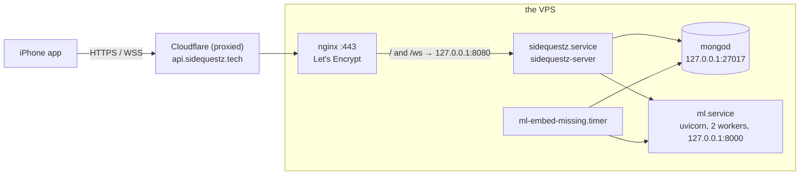

# Deployment

The API and the ML service run on one VPS (Vultr, Debian 12) behind Cloudflare; MongoDB runs on the
same machine. This page is the operator's view: layout, services, scripts, the runbook, rollback,
logs, secrets, Cloudflare and Facebook specifics, the local loop and troubleshooting. Design:
[design/app-docs-deploy.md](design/app-docs-deploy.md) §3.

## Topology



Only 80 and 443 are reachable from outside; `ufw` blocks 8080, 8000 and 27017, and all three services
bind to loopback. There is no public route to the ML service: `/v1/…` from the internet reaches the Go
API, which answers 404. The nginx site is `Backend/sidequestz.tech` (`client_max_body_size 20M` for photo
uploads, HTTP/1.1 upgrade on `/ws`, long proxy timeouts on the socket). There is no website:
`sidequestz.tech` has no DNS record, and `https://api.sidequestz.tech/` answers
`404 {"error":"not_found","message":"Not found."}` by design.

## Layout on the server

| Path | Contents |
|---|---|
| `/opt/backend/sidequestz-server`, `/opt/backend/sidequestz-admin` | the API and optional maintenance CLI (static linux/amd64); uploaded binaries keep a `*.prev` backup |
| `/opt/backend/.env` | the API's environment, mode 0600, owned by `sidequestz` (see below) |
| `/opt/ml/` | the `ml/` tree without secrets, caches, venvs or the training and data-generation code; `/opt/ml/.venv`; `/opt/ml/.cache` (model weights, the embedding cache); `/opt/ml.prev` is the previous tree |
| `/opt/ml/.env`, `/opt/ml/gcp-sa.json` | the ML service's secrets, mode 0600 |
| `/etc/systemd/system/sidequestz.service`, `ml.service`, `ml-embed-missing.service`, `ml-embed-missing.timer` | the units, installed by the deploy scripts (the old `backend.service` unit is retired) |
| `/etc/nginx/sites-available/sidequestz.tech` | the site, TLS managed by Certbot |

The optional admin tool handles database maintenance, demo seeding and signing-key generation.
The API does not need it to run and creates its indexes at startup. Build it with `./build.sh --admin`
or upload it with `./deploy.sh --admin` when maintenance is needed. It reads the server environment,
or a file given with `--env-file`, without overriding variables already set:

```sh
/opt/backend/sidequestz-admin --env-file /opt/backend/.env ensure-indexes                   # every index the server expects
/opt/backend/sidequestz-admin --env-file /opt/backend/.env drop-ttl <collection> [--force]    # "activities" needs --force
/opt/backend/sidequestz-admin --env-file /opt/backend/.env reset-app-data --yes [--users]     # drop the app collections, never the catalogs
/opt/backend/sidequestz-admin --env-file /opt/backend/.env seed-demo                         # the demo account and its world (idempotent)
```

## Services and environment

| Unit | Runs | Notes |
|---|---|---|
| `sidequestz.service` (the repo's `Backend/backend.service`, installed under the `DEPLOY_SERVICE` name) | `/opt/backend/sidequestz-server` as user `sidequestz`, `EnvironmentFile=/opt/backend/.env`, `Restart=always`, `RestartSec=3`, `LimitNOFILE=65536`, `NoNewPrivileges`, `ProtectSystem=full`, `ProtectHome`, `PrivateTmp` | no inline `Environment=` lines. Startup validates the configuration, pings Mongo and exits on failure, ensures every index (an index that exists with other options is fatal), then listens on `127.0.0.1:8080` |
| `ml.service` | `/opt/ml/.venv/bin/uvicorn api.main:app --host 127.0.0.1 --port 8000 --workers 2` as root with `PYTHONPATH=/opt/ml RANKING_MODEL=classifier RANKING_DEVICE=cpu USER_EMBEDDING_ALPHA=0.8 SEARCH_WEIGHT=0.6 RERANK_TOP_K=12 RERANK_TIMEOUT_SECONDS=15 EMBED_PROVIDER=auto EMBED_CACHE_PATH=/opt/ml/.cache/embeddings.sqlite EMBED_LOCAL_THREADS=8 OMP_NUM_THREADS=8 HF_HOME=/opt/ml/.cache HF_HUB_DISABLE_TELEMETRY=1`, `EnvironmentFile=-/opt/ml/.env`, `TimeoutStartSec=300`, `ProtectHome=true`, `ReadWritePaths=/opt/ml/.cache` | startup never waits for the model: a background warmup loads it (20–60 s on the VPS) |
| `ml-embed-missing.timer` → `ml-embed-missing.service` | `python -m tools.embed_missing` on both catalogs, 2 min after boot and every 15 min (oneshot, 15 min timeout) | embeds activities that have text but no current vector |

`/opt/backend/.env` (created once by hand, never uploaded; template `Backend/.env.example`):

```
APP_ENV=prod
HTTP_ADDR=127.0.0.1:8080
PUBLIC_BASE_URL=https://api.sidequestz.tech
MONGO_URI=mongodb://127.0.0.1:27017
MONGO_DB=freetime
ML_SERVICE_URL=http://127.0.0.1:8000
JWT_SECRET=<openssl rand -base64 48>
PLANNER=dag
TRUST_PROXY=1
FB_APP_ID=<Meta app id>
FB_APP_SECRET=<Meta app secret>
FB_TOKEN_KEY=<openssl rand -hex 32>
DEMO_PASSWORD=<the demo account's password>
```

`FB_TOKEN_KEY` (64 hex characters) seals the stored Facebook tokens. Set it in production: without it
the key is derived from `JWT_SECRET`, so rotating the JWT secret would also make every stored Facebook
token unreadable. Optional: `ML_*` timeouts, `PLANNER_*` knobs ([PLANNER.md](PLANNER.md)),
`FB_GRAPH_VERSION` (`v26.0`), `DEMO_DATE` (unset; production `2026-09-27`: demo-catalog accounts live on that date at the real time of day), `DEMO_TZ` (`America/New_York`), `DEV_RESET_CODES` (`0`),
`CHECKOUT_STEP_DELAY` (`1500ms`), `ACCESS_TOKEN_TTL` (`1h`), `REFRESH_TOKEN_TTL` (`720h`),
`MAX_PHOTO_BYTES` (2 MB), `MAX_JSON_BYTES` (1 MB). `PORT` is accepted in place of `HTTP_ADDR`.

Agentic checkout (optional; the endpoints answer 503 until all of these are set). Stripe **test**
keys only: both services refuse live keys.

```
PAYMENTS_MODE=sandbox
STRIPE_SECRET_KEY=sk_test_…              # the agent's Stripe test account
STRIPE_SELLER_PROFILE=profile_test_…     # the Events merchant sandbox TEST profile (stripe-spt-smoke.sh prints it)
MERCHANT_HOST=events.sidequestz.tech     # the authority the TAP signature covers
MERCHANT_BASE_URL=https://events.sidequestz.tech
TAP_AGENT_KEY=<from sidequestz-admin tap-keygen>   # secret; its public half goes on Events
MUSE_API_KEY=<Meta Model API key>        # optional: without it the server buys in itinerary order itself
```

Optional: `MUSE_MODEL` (`muse-spark-1.3`), `MUSE_BASE_URL` (`https://api.meta.ai/v1`), `AGENT_MAX_TURNS`
(`24`), `CHECKOUT_RUN_TIMEOUT` (`3m`). Check the Stripe path with `Backend/scripts/stripe-spt-smoke.sh`.

### Events merchant (`events.sidequestz.tech`)

A separate Go service in `Events/` on `127.0.0.1:8085`, behind nginx and Cloudflare like the API (DNS,
nginx site and certificate are set up alongside `api.sidequestz.tech`). Its env lives in `Events/.env` on
the deploying Mac (gitignored; template `Events/.env.example`): `Events/deploy.sh` builds, uploads it to
`/opt/events/.env` on every deploy (mode 600) and sets `MERCHANT_BASE_URL=https://events.sidequestz.tech`
there. Production values:

```
APP_ENV=prod
HTTP_ADDR=127.0.0.1:8085
MERCHANT_HOST=events.sidequestz.tech
MERCHANT_BASE_URL=https://events.sidequestz.tech
PAYMENTS_MODE=sandbox
DEMO_KEY=<openssl rand -hex 16>          # X-Demo-Key for POST /_demo/scenario; the default is refused outside dev
TAP_AGENT_PUBLIC_KEY=<from sidequestz-admin tap-keygen>   # required outside dev
STRIPE_SECRET_KEY=sk_test_…              # the merchant sandbox: a DIFFERENT Stripe account from the Backend
MONGO_URI=mongodb://127.0.0.1:27017
MONGO_DB=sidequestz_events
```

The catalog's ticketed events must point at it: `Backend/scripts/migrate-ticket-host.sh` (dry run by
default, `--apply` to write) rewrites their `url`, `ticketUrl` and `sources[].url` in
`freetime.demo_activities` from `https://saltlight.example/` to `https://events.sidequestz.tech/`.

`/opt/ml/.env`: `HF_TOKEN`, `TYPESAFE_API_KEY`, `GOOGLE_APPLICATION_CREDENTIALS=/opt/ml/gcp-sa.json`, and
any `EMBED_*` / `VERTEX_*` override ([EMBEDDINGS.md](EMBEDDINGS.md)). Without the file the service still
runs: it embeds locally and ranks without Jev.

## Deploy scripts

Both scripts take the connection settings from the environment or a `.env` file and read nothing else
from it: `Backend/deploy.sh` reads `DEPLOY_*` from the repo-root `.env` and then `Backend/.env` (the
first to set a variable wins); `ml/deploy.sh` reads `DEPLOY_*` and `ML_DEPLOY_*` from the first of
`ml/.env`, `Backend/.env` and the root `.env`. They authenticate non-interactively (`sshpass` or
`SSH_ASKPASS`, else your SSH keys) and never print the values. The Backend service defaults to `sidequestz`; `DEPLOY_SERVICE` can override the unit name.

| Script | What it does |
|---|---|
| `Backend/build.sh [--native] [--admin]` | Builds the static, stripped server for Linux/amd64. Set `GOOS`/`GOARCH` for another target, or use `--native` for this machine. `--admin` also builds the maintenance CLI. Tests run separately with `make test`. |
| `Backend/deploy.sh [host] [user] [--admin]` | Checks the remote `.env`, builds Linux/amd64, uploads the server and service unit, keeps the previous binary, restarts and retries `/healthz`. `--admin` also uploads the CLI. Supports SSH keys or `DEPLOY_PASSWORD`. Never uploads or rewrites `.env`; sets its ownership and permissions. No database seeding or tests run during deployment. |
| `ml/deploy.sh [--skip-tests] [host] [user] [password]` | 1. runs the unit tests locally; 2. snapshots `/opt/ml` to `/opt/ml.prev` (hard links, `cp -al`); 3. rsyncs `ml/` with `--delete`, excluding `.env*`, `*.env`, `gcp-sa.json`, `*.pem`, `*.key`, `.cache`, venvs, `datagen/`, `data/`, `*.sbatch`, `wandb/` and `runs/` (excluded paths on the server are kept); 4. directories 755, files 644, secrets 600; creates the venv and installs `requirements-serve.txt` with CPU torch wheels; prefetches the Qwen weights into `/opt/ml/.cache`; installs and enables `ml.service` and the timer; restarts; 5. waits about 5 minutes at most for `/healthz`, then embeds one text through `/healthz?probe=1` and fails loudly (with the last 50 log lines) if either does not come up; only then starts the timer |

## Runbook

**0. On the Mac.** Go toolchain, Docker with `sq-mongo` running (for the tests), the root `.env`,
`DEVELOPER_DIR=/Applications/Xcode-26.6.app/Contents/Developer`.

**1. Server prep (once).** Create `/opt/backend` and `/opt/ml/.cache`, write `/opt/backend/.env` and
`/opt/ml/.env` with `umask 077` (values from the root `.env` or newly generated, never echoed), copy
`gcp-sa.json` to `/opt/ml/` with mode 600, and confirm `ufw status` still blocks 8080, 8000 and 27017.
Both `.env` files must show `-rw-------`. The catalogs must be in `freetime`: `activities` from the
ingestion snapshot, `demo_activities` is the embedded Saltlight catalog of record (texts and vectors), which
`Backend/scripts/pull-demo-catalog.sh` copies to a local Mongo ([DATA.md](DATA.md#the-demo-snapshot)).

**2. ML service.**

```sh
cd ml && ./deploy.sh
ssh <host> 'systemctl is-active ml; curl -s 127.0.0.1:8000/healthz | jq "{status, mode: .embedding.mode, provider: .embedding.provider, jev}"'
```

**3. Backend.**

```sh
cd Backend && make test && ./deploy.sh --admin  # --admin is needed for the maintenance commands below
ssh <host> 'systemctl is-active sidequestz; ss -ltnp | grep 8080; journalctl -u sidequestz -n 30 --no-pager'
```

The log shows "MongoDB connected, indexes ensured", "planner ready" and the listener on `127.0.0.1:8080`
only (`ss` lists no other address).

**4. Data and the demo account** (on the server):

```sh
A="/opt/backend/sidequestz-admin --env-file /opt/backend/.env"
$A reset-app-data --yes          # drop the app collections; keeps the catalogs and the users (--users drops those too)
$A ensure-indexes
$A drop-ttl demo_activities      # the demo events must not expire (a no-op when there is no TTL index)
$A seed-demo                     # Sandy Byte, Marin, Theo and their world; prints what it wrote
mongosh freetime --eval 'db.users.findOne({email:"demo@sidequestz.tech"},{name:1,homeBase:1,city:1,setupComplete:1,embeddingModel:1})'
```

`seed-demo` refuses to write anything when `DEMO_PASSWORD` is missing or `demo_activities` has fewer than
three Saltlight places. Its last lines report Marin's open plan and whether Sandy's taste vectors were
refreshed through the ML service. A full reset, judges' accounts included, is `reset-app-data --yes
--users` followed by `ensure-indexes` and `seed-demo`.

**5. Smoke tests.** From the Mac, against the public URL:

```sh
BASE_URL=https://api.sidequestz.tech Backend/scripts/smoke.sh
```

It checks `/healthz`, signs up a throwaway `smoke.<time>@example.test` account, reads `/me`, rotates
the refresh token, logs out and confirms the old refresh token is refused (curl and jq; it never prints
a token). Then the app, end to end:

```sh
TEST_RUNNER_SQ_LIVE_DEMO_PASSWORD='…' xcodebuild test -project frontend/SideQuestz.xcodeproj -scheme SideQuestz \
  -destination 'platform=iOS Simulator,name=iPhone 17e' -only-testing:SideQuestzUITests/LiveSmokeUITests
```

`LiveSmokeUITests` signs in with "Use the demo account", checks that Home loads, that the Forum shows
"Golden hour by the market", Groups "Saturday market crew" and Account "Sandy Byte", plans a sidequest up
to Review, and attaches a screenshot of each screen to the test result. It never starts a sidequest, so
the seeded data stays as it is. `TEST_RUNNER_SQ_LIVE_API_URL` points it at another server. On the
deployed server `/plans/generate` answers in 0.2–0.6 s, far under Cloudflare's 100 s cap.

**6. The app on a phone.** Build with the demo password and install:

```sh
xcodebuild -project frontend/SideQuestz.xcodeproj -scheme SideQuestz -configuration Debug \
  -destination id=<device id from `xcrun xctrace list devices`> -derivedDataPath /tmp/DD-device \
  -allowProvisioningUpdates SQ_DEMO_PASSWORD='…' build
xcrun devicectl device install app --device <device id> /tmp/DD-device/Build/Products/Debug-iphoneos/SideQuestz.app
```

## Rollback

| Part | Command |
|---|---|
| Backend | `cd /opt/backend && mv -f sidequestz-server.prev sidequestz-server && systemctl restart sidequestz` (restore `sidequestz-admin.prev` too if you deployed the CLI) |
| ML | `rm -rf /opt/ml && mv /opt/ml.prev /opt/ml && systemctl restart ml` |
| Data | the seed is idempotent; rerun step 4 |
| App | reinstall the previous `.app`, or relaunch with `-SQAPIMode mock` to demo offline |

## Logs and health checks

```sh
journalctl -u sidequestz -f -n 50       # request log with ids, "planner: generate" lines with timings, ML fallbacks
journalctl -u ml -f -n 50               # one INFO line per embed call, WARNING on a provider fallback
curl -s 127.0.0.1:8080/healthz          # {"ok":true}, or 503 when Mongo does not answer the ping
curl -s 127.0.0.1:8000/healthz | jq     # status, embedding mode and provider, jev, model versions
curl -s https://api.sidequestz.tech/healthz
systemctl list-timers ml-embed-missing.timer
journalctl -u ml-embed-missing -n 20    # per-collection counts of the last embed run
mongosh freetime --eval 'db.plan_runs.find({}, {createdAt:1, "final.totalMs":1, "ml.mode":1}).sort({createdAt:-1}).limit(5)'
```

To inspect the database from a Mac, tunnel it (Mongo is loopback-only) and connect Compass or `mongosh`
to `mongodb://127.0.0.1:27017`:

```sh
ssh -N -L 27017:127.0.0.1:27017 <user>@<host>
```

## Secrets

- The only copies are the root `.env` on a developer's Mac (gitignored, never in a worktree),
  `/opt/backend/.env`, `/opt/ml/.env` and `/opt/ml/gcp-sa.json` on the server, all mode 0600.
- `JWT_SECRET` is generated once with `openssl rand -base64 48`; rotating it signs everyone out.
  `FB_TOKEN_KEY` is generated once with `openssl rand -hex 32`; rotating it makes the stored Facebook
  tokens unreadable, and those users are asked to sign in to Facebook again.
- Units carry no secrets; the scripts never upload `.env` files; nothing prints a value. Reset codes
  appear in the API log (password-reset delivery is simulated) and in responses only with
  `DEV_RESET_CODES=1`, which the VPS does not set.
- The Meta app secret, the HF token and the TypeSafe key are revoked and reissued from their dashboards;
  after editing the file, `systemctl restart sidequestz` or `ml`.

## Cloudflare notes

- The hostname is proxied (orange cloud). Proxied WebSockets work; the hub pings every 25 s and reads
  with a 60 s deadline, well under Cloudflare's idle timeout. `TRUST_PROXY=1` makes the API rate-limit
  on the forwarded client address instead of Cloudflare's.
- Requests are cut off after 100 s. Plan generation has a 9 s hard timeout and a 5 s soft budget, so a
  `524` from Cloudflare means the process, not the planner, is stuck.
- TLS is terminated twice: Cloudflare to nginx uses the Let's Encrypt certificate (set the SSL mode to
  Full (strict)); the API sees `X-Forwarded-Proto: https`.
- `GET /photos/{id}` answers with `Cache-Control: public, max-age=31536000, immutable`; Cloudflare may
  cache it, which is fine because photo ids are never reused.

## Facebook (Meta dashboard)

The connector needs `FB_APP_ID` and `FB_APP_SECRET` (without them its routes answer 503 "Facebook isn't
set up on this server yet."). In the Meta app's dashboard:

| Setting | Value |
|---|---|
| Valid OAuth Redirect URIs (Facebook Login) | `https://api.sidequestz.tech/integrations/facebook/callback` |
| Deauthorize callback URL | `https://api.sidequestz.tech/integrations/facebook/deauthorize` |
| Data deletion request URL | `https://api.sidequestz.tech/integrations/facebook/data-deletion` |
| App roles › Testers | every account that will connect, while the app is in Development mode |

Going live needs App Review ([ROADMAP.md](ROADMAP.md)).

## Local development loop

```sh
docker start sq-mongo                    # freetime holds the Atlanta sample and demo_activities (see docs/DATA.md)
cd ml && .venv/bin/uvicorn api.main:app --port 8000
cd Backend && APP_ENV=dev HTTP_ADDR=127.0.0.1:8080 MONGO_URI=mongodb://127.0.0.1:27017 MONGO_DB=freetime \
  ML_SERVICE_URL=http://127.0.0.1:8000 JWT_SECRET=dev-secret-dev-secret-dev-secret-dev PLANNER=dag \
  PUBLIC_BASE_URL=http://127.0.0.1:8080 DEMO_PASSWORD=demo \
  sh -c 'go run ./cmd/sidequestz-admin seed-demo && go run .'
# Simulator launch arguments: -SQAPIBaseURL http://127.0.0.1:8080 -SQWebSocketURL ws://127.0.0.1:8080/ws -SQDemoPassword demo
```

`APP_ENV=dev` relaxes the JWT-secret check (a missing secret becomes a random one), defaults
`PUBLIC_BASE_URL` to the listen address, reads Facebook's app id and secret from the gitignored
repo-root `meta_app_id` / `meta_app_secret` files when the variables are unset, and allows
`DEV_RESET_CODES=1`. `make build-native` builds the server for the Mac; `make build-admin` also builds the CLI. The Go tests use
`MONGO_TEST_URI` (default the same local server) and create and drop `sq_test_*` databases; `make
test-db` runs them all with the race detector and fails instead of skipping when Mongo is down.

## Troubleshooting

| Symptom | Cause and fix |
|---|---|
| `sidequestz` exits at startup with "invalid configuration" | a required variable is missing or invalid (`JWT_SECRET` shorter than 32 bytes or a placeholder, `PUBLIC_BASE_URL` without `http(s)://`, an unknown `PLANNER`); the log line lists each problem |
| `sidequestz` exits with a Mongo error | `mongod` is down or `MONGO_URI` is wrong; the API never runs without its database |
| startup: "ensure indexes … exists with different options" | an old index with the same name; drop it (`db.<coll>.dropIndex("<name>")`) and restart |
| `GET /healthz` is 503 | the Mongo ping failed; check `systemctl status mongod` |
| `/plans/*` answer 503 "Planning is warming up. Try again in a moment." | the planner did not start; the log says "planner not started" with the reason |
| Facebook routes answer 503 "Facebook isn't set up on this server yet." | `FB_APP_ID` / `FB_APP_SECRET` are not set (the log says "Facebook connector off"), or `FB_TOKEN_KEY` is not 64 hex characters ("Facebook tokens cannot be stored") |
| Facebook connect ends in `status=error` | the redirect URI is not in the dashboard, or the person is not a tester while the app is in Development mode |
| `seed-demo`: "demo_activities has N saltlight places" | import the snapshot first ([DATA.md](DATA.md#the-demo-snapshot)) |
| `seed-demo`: "@sandybyte belongs to another account" | someone registered the handle; rename or delete that account, then seed again |
| `ml` takes minutes to become active, or `providers.local` says `loading` | the first model load; wait for `loaded`; the deploy's health loop waits too |
| `/healthz` says `degraded` | no embedding provider can serve; the local model failed to load (see `journalctl -u ml`) |
| `embedding.provider` is `local` | expected today: the Vertex and HF credentials are refused, so the local model serves ([EMBEDDINGS.md](EMBEDDINGS.md)) |
| `plan_runs.ml.mode` is `fallback:…` | the classifier call failed or timed out; check the `ml` log and `PLANNER_ML_TIMEOUT_MS` |
| Cloudflare `524` on `/plans/generate` | the request exceeded 100 s; look for a stuck Mongo or ML call in the API log, not at the planner budget |
| the app on a phone cannot reach a local server | `127.0.0.1` only works in the Simulator; use the Mac's LAN address in `-SQAPIBaseURL` (plain `http://` is allowed for local networks only) |
| no "Use the demo account" link | the build had no `SQ_DEMO_PASSWORD` and no `-SQDemoPassword` argument, or the app is in mock mode |
| demo events vanished | a TTL index on `demo_activities`; `drop-ttl demo_activities`, then reimport the snapshot ([DATA.md](DATA.md)) |
