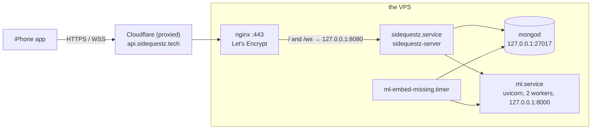

# Deployment

The API and the ML service run on one VPS (Vultr, Debian 12) behind Cloudflare; MongoDB runs on the
same machine. This page is the operator's view: layout, services, scripts, the runbook, rollback,
logs, secrets, Cloudflare and Facebook specifics, the local loop and troubleshooting. Design:
[design/app-docs-deploy.md](design/app-docs-deploy.md) §3.

## Topology



Only 80 and 443 are reachable from outside; `ufw` blocks 8080, 8000 and 27017, and all three services
bind to loopback. There is no public route to the ML service: `/v1/…` from the internet reaches the Go
API, which answers 404. The nginx site is `Backend/sidequestz.tech` (`client_max_body_size 20M` for photo
uploads, HTTP/1.1 upgrade on `/ws`, long proxy timeouts on the socket). There is no website:
`sidequestz.tech` has no DNS record, and `https://api.sidequestz.tech/` answers
`404 {"error":"not_found","message":"Not found."}` by design.

## Layout on the server

| Path | Contents |
|---|---|
| `/opt/backend/sidequestz-server` | the API (static linux/amd64) |
| `/opt/backend/.env` | the API's environment, mode 0600, owned by `sidequestz` (see below) |
| `/opt/ml/` | the `ml/` tree without secrets, caches, venvs or the training and data-generation code; `/opt/ml/.venv`; `/opt/ml/.cache` (model weights, the embedding cache) |
| `/opt/ml/.env`, `/opt/ml/gcp-sa.json` | the ML service's secrets, mode 0600 |
| `/etc/systemd/system/sidequestz.service`, `ml.service`, `ml-embed-missing.service`, `ml-embed-missing.timer` | the units, installed by the deploy scripts (the old `backend.service` unit is retired) |
| `/etc/nginx/sites-available/sidequestz.tech` | the site, TLS managed by Certbot |

The API creates its required indexes at startup. Accounts are created through signup.

## Services and environment

| Unit | Runs | Notes |
|---|---|---|
| `sidequestz.service` (the repo's `Backend/backend.service`, installed as `sidequestz.service`) | `/opt/backend/sidequestz-server` as user `sidequestz`, `EnvironmentFile=/opt/backend/.env`, `Restart=always`, `RestartSec=3`, `LimitNOFILE=65536`, `NoNewPrivileges`, `ProtectSystem=full`, `ProtectHome`, `PrivateTmp` | no inline `Environment=` lines. Startup validates the configuration, pings Mongo and exits on failure, ensures every index (an index that exists with other options is fatal), then listens on `127.0.0.1:8080` |
| `ml.service` | `/opt/ml/.venv/bin/uvicorn api.main:app --host 127.0.0.1 --port 8000 --workers 2` as root with `PYTHONPATH=/opt/ml RANKING_MODEL=classifier RANKING_DEVICE=cpu USER_EMBEDDING_ALPHA=0.8 SEARCH_WEIGHT=0.6 RERANK_TOP_K=12 RERANK_TIMEOUT_SECONDS=15 EMBED_PROVIDER=auto EMBED_CACHE_PATH=/opt/ml/.cache/embeddings.sqlite EMBED_LOCAL_THREADS=8 OMP_NUM_THREADS=8 HF_HOME=/opt/ml/.cache HF_HUB_DISABLE_TELEMETRY=1`, `EnvironmentFile=-/opt/ml/.env`, `TimeoutStartSec=300`, `ProtectHome=true`, `ReadWritePaths=/opt/ml/.cache` | startup never waits for the model: a background warmup loads it (20–60 s on the VPS) |
| `ml-embed-missing.timer` → `ml-embed-missing.service` | `python -m tools.embed_missing` on both catalogs, 2 min after boot and every 15 min (oneshot, 15 min timeout) | embeds activities that have text but no current vector |

`/opt/backend/.env` (uploaded from `Backend/.env` by `Backend/deploy_env.sh`; template `Backend/.env.example`):

```
APP_ENV=prod
HTTP_ADDR=127.0.0.1:8080
PUBLIC_BASE_URL=https://api.sidequestz.tech
MONGO_URI=mongodb://127.0.0.1:27017
MONGO_DB=freetime
ML_SERVICE_URL=http://127.0.0.1:8000
JWT_SECRET=<openssl rand -base64 48>
PLANNER=dag
TRUST_PROXY=1
FB_APP_ID=<Meta app id>
FB_APP_SECRET=<Meta app secret>
FB_TOKEN_KEY=<openssl rand -hex 32>
```

`FB_TOKEN_KEY` (64 hex characters) seals the stored Facebook tokens. Set it in production: without it
the key is derived from `JWT_SECRET`, so rotating the JWT secret would also make every stored Facebook
token unreadable. Optional: `ML_*` timeouts, `PLANNER_*` knobs ([PLANNER.md](PLANNER.md)),
`FB_GRAPH_VERSION` (`v26.0`), `DEMO_DATE` (unset; production `2026-09-27`: demo-catalog accounts live on that date at the real time of day), `DEMO_TZ` (`America/New_York`), `DEV_RESET_CODES` (`0`),
`CHECKOUT_STEP_DELAY` (`1500ms`), `ACCESS_TOKEN_TTL` (`1h`), `REFRESH_TOKEN_TTL` (`720h`),
`MAX_PHOTO_BYTES` (2 MB), `MAX_JSON_BYTES` (1 MB). `PORT` is accepted in place of `HTTP_ADDR`.

Agentic checkout (optional; the endpoints answer 503 until all of these are set). Stripe **test**
keys only: both services refuse live keys.

```
PAYMENTS_MODE=sandbox
STRIPE_SECRET_KEY=sk_test_…              # the agent's Stripe test account
STRIPE_SELLER_PROFILE=profile_test_…     # the Events merchant sandbox TEST profile (stripe-spt-smoke.sh prints it)
MERCHANT_HOST=events.sidequestz.tech     # the authority the TAP signature covers
MERCHANT_BASE_URL=https://events.sidequestz.tech
TAP_AGENT_KEY=<base64 32-byte Ed25519 seed>       # secret; its public half goes on Events
MUSE_API_KEY=<Meta Model API key>        # optional: without it the server buys in itinerary order itself
```

Optional: `MUSE_MODEL` (`muse-spark-1.3`), `MUSE_BASE_URL` (`https://api.meta.ai/v1`), `AGENT_MAX_TURNS`
(`24`), `CHECKOUT_RUN_TIMEOUT` (`3m`). Check the Stripe path with `Backend/scripts/stripe-spt-smoke.sh`.

### Events merchant (`events.sidequestz.tech`)

A separate Go service in `Events/` on `127.0.0.1:8085`, behind nginx and Cloudflare like the API (DNS,
nginx site and certificate are set up alongside `api.sidequestz.tech`). Its env lives in `Events/.env` on
the deploying machine (gitignored; template `Events/.env.example`): `Events/deploy_env.sh` uploads it
to `/opt/events/.env` (mode 600). Set `MERCHANT_BASE_URL` in the local file. Production values:

```
APP_ENV=prod
HTTP_ADDR=127.0.0.1:8085
MERCHANT_HOST=events.sidequestz.tech
MERCHANT_BASE_URL=https://events.sidequestz.tech
PAYMENTS_MODE=sandbox
DEMO_KEY=<openssl rand -hex 16>          # X-Demo-Key for POST /_demo/scenario; the default is refused outside dev
TAP_AGENT_PUBLIC_KEY=<base64 32-byte Ed25519 public key> # required outside dev
STRIPE_SECRET_KEY=sk_test_…              # the merchant sandbox: a DIFFERENT Stripe account from the Backend
MONGO_URI=mongodb://127.0.0.1:27017
MONGO_DB=sidequestz_events
```

The catalog's ticketed events must point at it: `Backend/scripts/migrate-ticket-host.sh` (dry run by
default, `--apply` to write) rewrites their `url`, `ticketUrl` and `sources[].url` in
`freetime.demo_activities` from `https://saltlight.example/` to `https://events.sidequestz.tech/`.

`/opt/ml/.env`: `HF_TOKEN`, `TYPESAFE_API_KEY`, `GOOGLE_APPLICATION_CREDENTIALS=/opt/ml/gcp-sa.json`, and
any `EMBED_*` / `VERTEX_*` override ([EMBEDDINGS.md](EMBEDDINGS.md)). Without the file the service still
runs: it embeds locally and ranks without Jev.

## Deploy scripts

From the repository root, run `bash deploy.sh` to deploy ML, Events, then Backend.
Each service's `deploy.sh` also works on its own. The scripts stop on command failures.
Code deployment never uploads or changes `.env` files. Run `bash deploy_env.sh` separately to
upload `Events/.env` and `Backend/.env` to the matching `/opt/<service>/.env`.
Backend and Events each have their own `deploy_env.sh` too. ML secrets remain provisioned separately. Environment uploads set ownership and mode 600,
and restart the matching service to apply the new values. They do not build or deploy code.
These scripts expect the services to be installed already. On a fresh server, provision the
initial environment files before deploying code; use `deploy_env.sh` for subsequent updates.
Tests run separately; there are no test flags, backups or health-check loops.

Set `DEPLOY_HOST`, `DEPLOY_USER` (default `root`) and optionally `DEPLOY_PASSWORD` in the root
`.env`. Shell environment values take precedence; service `.env` files and `Backend/.env`
provide fallbacks. Only these three connection settings are read. Optional `[host] [user]`
arguments override the destination. SSH handles authentication unless a saved password is set.
Deployments use the fixed paths and unit names below; the SSH account needs root privileges.

| Script | What it does |
|---|---|
| `deploy.sh` | Runs all three code deployments in order. |
| `deploy_env.sh` | Uploads Events and Backend environments in order. |
| `Backend/deploy_env.sh`, `Events/deploy_env.sh` | Uploads that service's local `.env` and restarts it, without deploying code. |
| `Backend/build.sh` | Builds the server for Linux/amd64 into `Backend/bin/`. |
| `Events/build.sh` | Builds the merchant for Linux/amd64 into `Events/bin/`. |
| `Backend/deploy.sh` | Builds/uploads the API and its unit, then restarts `sidequestz` in `/opt/backend`. Keeps the server's `.env`. |
| `Events/deploy.sh` | Builds/uploads the merchant and its unit, then restarts `events` in `/opt/events`. |
| `ml/deploy.sh` | Uploads serving code to `/opt/ml`, installs dependencies and model weights, then restarts `ml` and its embedding timer. Keeps server secrets, caches and the venv. |

## Runbook

**0. On the Mac.** Go toolchain, Docker with `sq-mongo` running (for the tests), the root `.env`,
`DEVELOPER_DIR=/Applications/Xcode-26.6.app/Contents/Developer`.

**1. Server prep (once).** Provision `/opt/backend/.env`, `/opt/events/.env` and `/opt/ml/.env`
with mode 600 before the first code deploy. Later updates to Backend and Events use the local
`Backend/.env` and `Events/.env` files and the root `bash deploy_env.sh`. Copy
`gcp-sa.json` to `/opt/ml/` with mode 600, and confirm `ufw status` still blocks 8080, 8000 and 27017.
Both `.env` files must show `-rw-------`. The catalogs must be in `freetime`: `activities` from the
ingestion snapshot, `demo_activities` is the embedded Saltlight catalog of record (texts and vectors), which
`Backend/scripts/pull-demo-catalog.sh` copies to a local Mongo ([DATA.md](DATA.md#the-demo-snapshot)).

**2. ML service.**

```sh
cd ml && ./deploy.sh
ssh <host> 'systemctl is-active ml; curl -s 127.0.0.1:8000/healthz | jq "{status, mode: .embedding.mode, provider: .embedding.provider, jev}"'
```

**3. Backend.**

```sh
cd Backend && bash deploy.sh
ssh <host> 'systemctl is-active sidequestz; ss -ltnp | grep 8080; journalctl -u sidequestz -n 30 --no-pager'
```

The log shows "MongoDB connected, indexes ensured", "planner ready" and the listener on `127.0.0.1:8080`
only (`ss` lists no other address).

**4. Data and accounts.** The API uses the existing database. Create new accounts through signup;
existing demo accounts and fixture records remain available. There is no automatic seed/reset command.

**5. Smoke tests.** From the Mac, against the public URL:

```sh
BASE_URL=https://api.sidequestz.tech Backend/scripts/smoke.sh
```

It checks `/healthz`, signs up a throwaway `smoke.<time>@example.test` account, reads `/me`, rotates
the refresh token, logs out and confirms the old refresh token is refused (curl and jq; it never prints
a token). Then the app, end to end:

```sh
TEST_RUNNER_SQ_LIVE_DEMO_PASSWORD='…' xcodebuild test -project frontend/SideQuestz.xcodeproj -scheme SideQuestz \
  -destination 'platform=iOS Simulator,name=iPhone 17e' -only-testing:SideQuestzUITests/LiveSmokeUITests
```

`LiveSmokeUITests` signs in with "Use the demo account", checks that Home loads, that the Forum shows
"Golden hour by the market", Groups "Saturday market crew" and Account "Sandy Byte", plans a sidequest up
to Review, and attaches a screenshot of each screen to the test result. It never starts a sidequest, so
the seeded data stays as it is. `TEST_RUNNER_SQ_LIVE_API_URL` points it at another server. On the
deployed server `/plans/generate` answers in 0.2–0.6 s, far under Cloudflare's 100 s cap.

**6. The app on a phone.** Build with the demo password and install:

```sh
xcodebuild -project frontend/SideQuestz.xcodeproj -scheme SideQuestz -configuration Debug \
  -destination id=<device id from `xcrun xctrace list devices`> -derivedDataPath /tmp/DD-device \
  -allowProvisioningUpdates SQ_DEMO_PASSWORD='…' build
xcrun devicectl device install app --device <device id> /tmp/DD-device/Build/Products/Debug-iphoneos/SideQuestz.app
```

## Redeploy an earlier version

The scripts do not create backups. To restore earlier code, check out that revision and run
`bash deploy.sh` again. Database maintenance is separate from deployment.

## Logs and health checks

```sh
journalctl -u sidequestz -f -n 50       # request log with ids, "planner: generate" lines with timings, ML fallbacks
journalctl -u ml -f -n 50               # one INFO line per embed call, WARNING on a provider fallback
curl -s 127.0.0.1:8080/healthz          # {"ok":true}, or 503 when Mongo does not answer the ping
curl -s 127.0.0.1:8000/healthz | jq     # status, embedding mode and provider, jev, model versions
curl -s https://api.sidequestz.tech/healthz
systemctl list-timers ml-embed-missing.timer
journalctl -u ml-embed-missing -n 20    # per-collection counts of the last embed run
mongosh freetime --eval 'db.plan_runs.find({}, {createdAt:1, "final.totalMs":1, "ml.mode":1}).sort({createdAt:-1}).limit(5)'
```

To inspect the database from a Mac, tunnel it (Mongo is loopback-only) and connect Compass or `mongosh`
to `mongodb://127.0.0.1:27017`:

```sh
ssh -N -L 27017:127.0.0.1:27017 <user>@<host>
```

## Secrets

- Local environment files (`.env`, `Backend/.env`, `Events/.env`) hold deployment settings and service secrets.
  Server copies live at `/opt/backend/.env`, `/opt/events/.env`, `/opt/ml/.env` and `/opt/ml/gcp-sa.json`, mode 0600.
- `JWT_SECRET` is generated once with `openssl rand -base64 48`; rotating it signs everyone out.
  `FB_TOKEN_KEY` is generated once with `openssl rand -hex 32`; rotating it makes the stored Facebook
  tokens unreadable, and those users are asked to sign in to Facebook again.
- Units carry no secrets. Only `deploy_env.sh` uploads `.env` files; code deployment leaves them alone. Reset codes
  appear in the API log (password-reset delivery is simulated) and in responses only with
  `DEV_RESET_CODES=1`, which the VPS does not set.
- The Meta app secret, the HF token and the TypeSafe key are revoked and reissued from their dashboards;
  after editing the file, `systemctl restart sidequestz` or `ml`.

## Cloudflare notes

- The hostname is proxied (orange cloud). Proxied WebSockets work; the hub pings every 25 s and reads
  with a 60 s deadline, well under Cloudflare's idle timeout. `TRUST_PROXY=1` makes the API rate-limit
  on the forwarded client address instead of Cloudflare's.
- Requests are cut off after 100 s. Plan generation has a 9 s hard timeout and a 5 s soft budget, so a
  `524` from Cloudflare means the process, not the planner, is stuck.
- TLS is terminated twice: Cloudflare to nginx uses the Let's Encrypt certificate (set the SSL mode to
  Full (strict)); the API sees `X-Forwarded-Proto: https`.
- `GET /photos/{id}` answers with `Cache-Control: public, max-age=31536000, immutable`; Cloudflare may
  cache it, which is fine because photo ids are never reused.

## Facebook (Meta dashboard)

The connector needs `FB_APP_ID` and `FB_APP_SECRET` (without them its routes answer 503 "Facebook isn't
set up on this server yet."). In the Meta app's dashboard:

| Setting | Value |
|---|---|
| Valid OAuth Redirect URIs (Facebook Login) | `https://api.sidequestz.tech/integrations/facebook/callback` |
| Deauthorize callback URL | `https://api.sidequestz.tech/integrations/facebook/deauthorize` |
| Data deletion request URL | `https://api.sidequestz.tech/integrations/facebook/data-deletion` |
| App roles › Testers | every account that will connect, while the app is in Development mode |

Going live needs App Review ([ROADMAP.md](ROADMAP.md)).

## Local development loop

```sh
docker start sq-mongo                    # freetime holds the Atlanta sample and demo_activities (see docs/DATA.md)
cd ml && .venv/bin/uvicorn api.main:app --port 8000
cd Backend && APP_ENV=dev HTTP_ADDR=127.0.0.1:8080 MONGO_URI=mongodb://127.0.0.1:27017 MONGO_DB=freetime \
  ML_SERVICE_URL=http://127.0.0.1:8000 JWT_SECRET=dev-secret-dev-secret-dev-secret-dev PLANNER=dag \
  PUBLIC_BASE_URL=http://127.0.0.1:8080 go run .
# Simulator launch arguments: -SQAPIBaseURL http://127.0.0.1:8080 -SQWebSocketURL ws://127.0.0.1:8080/ws -SQDemoPassword demo
```

`APP_ENV=dev` relaxes the JWT-secret check (a missing secret becomes a random one), defaults
`PUBLIC_BASE_URL` to the listen address, reads Facebook's app id and secret from the gitignored
repo-root `meta_app_id` / `meta_app_secret` files when the variables are unset, and allows
`DEV_RESET_CODES=1`. `make build-native` builds the server for the Mac. The Go tests use
`MONGO_TEST_URI` (default the same local server) and create and drop `sq_test_*` databases; `make
test-db` runs them all with the race detector and fails instead of skipping when Mongo is down.

## Troubleshooting

| Symptom | Cause and fix |
|---|---|
| `sidequestz` exits at startup with "invalid configuration" | a required variable is missing or invalid (`JWT_SECRET` shorter than 32 bytes or a placeholder, `PUBLIC_BASE_URL` without `http(s)://`, an unknown `PLANNER`); the log line lists each problem |
| `sidequestz` exits with a Mongo error | `mongod` is down or `MONGO_URI` is wrong; the API never runs without its database |
| startup: "ensure indexes … exists with different options" | an old index with the same name; drop it (`db.<coll>.dropIndex("<name>")`) and restart |
| `GET /healthz` is 503 | the Mongo ping failed; check `systemctl status mongod` |
| `/plans/*` answer 503 "Planning is warming up. Try again in a moment." | the planner did not start; the log says "planner not started" with the reason |
| Facebook routes answer 503 "Facebook isn't set up on this server yet." | `FB_APP_ID` / `FB_APP_SECRET` are not set (the log says "Facebook connector off"), or `FB_TOKEN_KEY` is not 64 hex characters ("Facebook tokens cannot be stored") |
| Facebook connect ends in `status=error` | the redirect URI is not in the dashboard, or the person is not a tester while the app is in Development mode |
| `ml` takes minutes to become active, or `providers.local` says `loading` | the first model load; wait for `loaded`; check `/healthz` after it loads |
| `/healthz` says `degraded` | no embedding provider can serve; the local model failed to load (see `journalctl -u ml`) |
| `embedding.provider` is `local` | expected today: the Vertex and HF credentials are refused, so the local model serves ([EMBEDDINGS.md](EMBEDDINGS.md)) |
| `plan_runs.ml.mode` is `fallback:…` | the classifier call failed or timed out; check the `ml` log and `PLANNER_ML_TIMEOUT_MS` |
| Cloudflare `524` on `/plans/generate` | the request exceeded 100 s; look for a stuck Mongo or ML call in the API log, not at the planner budget |
| the app on a phone cannot reach a local server | `127.0.0.1` only works in the Simulator; use the Mac's LAN address in `-SQAPIBaseURL` (plain `http://` is allowed for local networks only) |
| no "Use the demo account" link | the build had no `SQ_DEMO_PASSWORD` and no `-SQDemoPassword` argument, or the app is in mock mode |
| demo events vanished | a TTL index on `demo_activities`; remove the unwanted catalog TTL index in MongoDB, then reimport the snapshot ([DATA.md](DATA.md)) |
